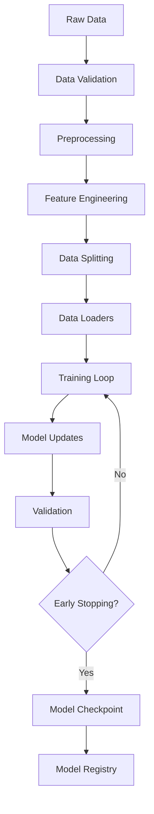
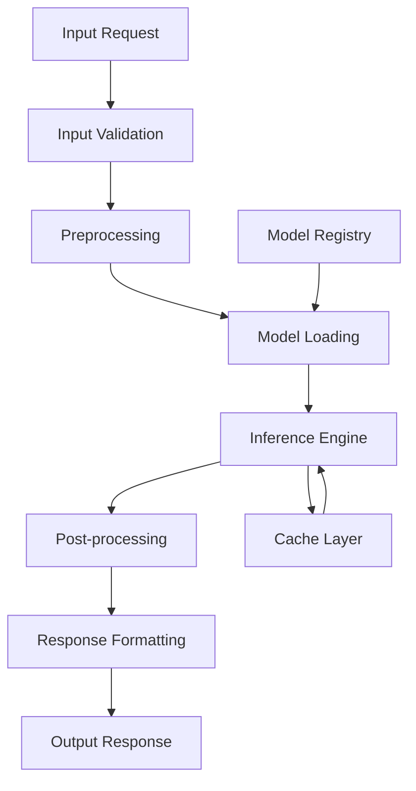
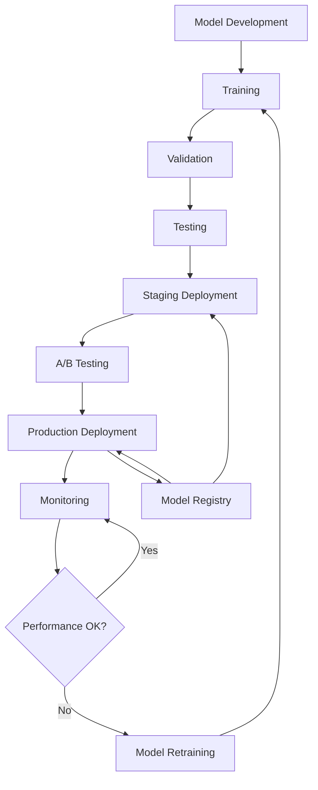

# 🏗️ LNMT Architecture Overview

This document provides a comprehensive overview of LNMT's architecture, design principles, and system components.

## Table of Contents

- [System Overview](#system-overview)
- [Core Components](#core-components)
- [Data Flow](#data-flow)
- [Deployment Architecture](#deployment-architecture)
- [Scalability & Performance](#scalability--performance)
- [Security & Compliance](#security--compliance)
- [Extension Points](#extension-points)

---

## System Overview

LNMT follows a modular, layered architecture designed for scalability, maintainability, and ease of use. The system is built around the principle of **separation of concerns**, with each layer responsible for specific functionality.

### High-Level Architecture

```
┌─────────────────────────────────────────────────────────────────┐
│                          User Interface Layer                   │
├─────────────────────────────────────────────────────────────────┤
│  Python API  │  CLI Tools  │  Web Dashboard  │  REST API       │
└─────────────────────────────────────────────────────────────────┘
                               │
┌─────────────────────────────────────────────────────────────────┐
│                         Orchestration Layer                     │
├─────────────────────────────────────────────────────────────────┤
│  Task Scheduler  │  Workflow Engine  │  Resource Manager       │
└─────────────────────────────────────────────────────────────────┘
                               │
┌─────────────────────────────────────────────────────────────────┐
│                          Core Engine Layer                      │
├─────────────────────────────────────────────────────────────────┤
│  Training Engine  │  Inference Engine  │  Model Management     │
└─────────────────────────────────────────────────────────────────┘
                               │
┌─────────────────────────────────────────────────────────────────┐
│                         Infrastructure Layer                    │
├─────────────────────────────────────────────────────────────────┤
│  Compute Resources  │  Storage  │  Networking  │  Monitoring    │
└─────────────────────────────────────────────────────────────────┘
```

### Design Principles

1. **Modularity**: Components are loosely coupled and highly cohesive
2. **Scalability**: Horizontal and vertical scaling support
3. **Reliability**: Fault tolerance and graceful error handling
4. **Performance**: Optimized for both training and inference workloads
5. **Usability**: Developer-friendly APIs and comprehensive tooling
6. **Extensibility**: Plugin architecture for custom components

---

## Core Components

### 1. Model Management System

The model management system handles the entire model lifecycle from creation to deployment.

```
┌─────────────────┐    ┌─────────────────┐    ┌─────────────────┐
│   Model Hub     │    │ Version Control │    │   Registry      │
├─────────────────┤    ├─────────────────┤    ├─────────────────┤
│ • Discovery     │◄──►│ • Git-like ops  │◄──►│ • Metadata      │
│ • Download      │    │ • Branching     │    │ • Search        │
│ • Validation    │    │ • Merging       │    │ • Governance    │
└─────────────────┘    └─────────────────┘    └─────────────────┘
         │                       │                       │
         └───────────────────────┼───────────────────────┘
                                 ▼
                    ┌─────────────────┐
                    │  Model Storage  │
                    ├─────────────────┤
                    │ • Artifacts     │
                    │ • Checkpoints   │
                    │ • Configurations│
                    └─────────────────┘
```

**Key Features:**
- **Model Versioning**: Git-like version control for models
- **Artifact Management**: Centralized storage for model files, weights, and metadata
- **Model Discovery**: Search and browse available models
- **Dependency Tracking**: Track model dependencies and relationships

### 2. Training Engine

The training engine provides distributed training capabilities with advanced optimization.

```
┌─────────────────┐    ┌─────────────────┐    ┌─────────────────┐
│  Data Pipeline  │    │ Training Loop   │    │  Optimization   │
├─────────────────┤    ├─────────────────┤    ├─────────────────┤
│ • Loading       │───►│ • Forward Pass  │◄───│ • Schedulers    │
│ • Preprocessing │    │ • Backward Pass │    │ • Gradient Clip │
│ • Augmentation  │    │ • Validation    │    │ • Mixed Precision│
└─────────────────┘    └─────────────────┘    └─────────────────┘
         │                       │                       │
         ▼                       ▼                       ▼
┌─────────────────┐    ┌─────────────────┐    ┌─────────────────┐
│  Distributed    │    │  Checkpointing  │    │   Monitoring    │
├─────────────────┤    ├─────────────────┤    ├─────────────────┤
│ • Data Parallel │    │ • Auto Save     │    │ • Metrics       │
│ • Model Parallel│    │ • Resume        │    │ • Logging       │
│ • Pipeline      │    │ • Best Model    │    │ • Visualization │
└─────────────────┘    └─────────────────┘    └─────────────────┘
```

**Distributed Training Strategies:**

1. **Data Parallel (DP/DDP)**:
   - Replicate model across devices
   - Split data across devices
   - Synchronize gradients

2. **Model Parallel**:
   - Split model across devices
   - Suitable for large models
   - Pipeline parallelism support

3. **Hybrid Approaches**:
   - Combine data and model parallelism
   - Optimize for specific hardware configurations

### 3. Inference Engine

High-performance inference engine with multiple optimization techniques.

```
┌─────────────────┐    ┌─────────────────┐    ┌─────────────────┐
│   Model Loader  │    │   Optimization  │    │   Serving       │
├─────────────────┤    ├─────────────────┤    ├─────────────────┤
│ • Lazy Loading  │───►│ • Quantization  │───►│ • Batching      │
│ • Model Sharding│    │ • Pruning       │    │ • Caching       │
│ • Format Conv.  │    │ • Distillation  │    │ • Load Balancing│
└─────────────────┘    └─────────────────┘    └─────────────────┘
         │                       │                       │
         ▼                       ▼                       ▼
┌─────────────────┐    ┌─────────────────┐    ┌─────────────────┐
│  Hardware Opt.  │    │  Runtime Engine │    │   API Gateway   │
├─────────────────┤    ├─────────────────┤    ├─────────────────┤
│ • GPU Kernels   │    │ • TensorRT      │    │ • Authentication│
│ • Memory Mgmt   │    │ • ONNX Runtime  │    │ • Rate Limiting │
│ • Multi-threading│    │ • TorchScript   │    │ • Monitoring    │
└─────────────────┘    └─────────────────┘    └─────────────────┘
```

**Optimization Techniques:**
- **Quantization**: INT8/FP16 precision reduction
- **Pruning**: Remove unnecessary parameters
- **Knowledge Distillation**: Create smaller, faster models
- **Dynamic Batching**: Optimize throughput
- **KV-Cache**: Optimize transformer inference

### 4. Data Processing Pipeline

Scalable data processing with support for various formats and transformations.

```
┌─────────────────┐    ┌─────────────────┐    ┌─────────────────┐
│   Data Sources  │    │  Preprocessing  │    │   Data Loaders  │
├─────────────────┤    ├─────────────────┤    ├─────────────────┤
│ • Files (JSON/  │───►│ • Tokenization  │───►│ • Batching      │
│   CSV/Parquet)  │    │ • Normalization │    │ • Shuffling     │
│ • Databases     │    │ • Augmentation  │    │ • Streaming     │
│ • APIs          │    │ • Filtering     │    │ • Caching       │
└─────────────────┘    └─────────────────┘    └─────────────────┘
         │                       │                       │
         ▼                       ▼                       ▼
┌─────────────────┐    ┌─────────────────┐    ┌─────────────────┐
│  Data Validation│    │   Transformation│    │   Data Storage  │
├─────────────────┤    ├─────────────────┤    ├─────────────────┤
│ • Schema Check  │    │ • Feature Eng.  │    │ • Distributed   │
│ • Quality Metrics│   │ • Encoding      │    │ • Compressed    │
│ • Anomaly Det.  │    │ • Scaling       │    │ • Versioned     │
└─────────────────┘    └─────────────────┘    └─────────────────┘
```

---

## Data Flow

### Training Data Flow



### Inference Data Flow



### Model Lifecycle Flow



---

## Deployment Architecture

### Cloud-Native Architecture

LNMT is designed for cloud-native deployment with Kubernetes as the primary orchestration platform.

```
┌─────────────────────────────────────────────────────────────────┐
│                              Load Balancer                       │
└─────────────────────────────────────────────────────────────────┘
                               │
                               ▼
┌─────────────────────────────────────────────────────────────────┐
│                            API Gateway                          │
├─────────────────────────────────────────────────────────────────┤
│  • Authentication  • Rate Limiting  • Request Routing          │
└─────────────────────────────────────────────────────────────────┘
                               │
                               ▼
┌──────────────────┐ ┌──────────────────┐ ┌──────────────────┐
│   Inference      │ │    Training      │ │   Management     │
│   Services       │ │    Services      │ │   Services       │
├──────────────────┤ ├──────────────────┤ ├──────────────────┤
│ • Model Serving  │ │ • Training Jobs  │ │ • Model Registry │
│ • Batch Inference│ │ • Experiment     │ │ • Monitoring     │
│ • Real-time API  │ │   Tracking       │ │ • Configuration  │
└──────────────────┘ └──────────────────┘ └──────────────────┘
         │                    │                    │
         ▼                    ▼                    ▼
┌─────────────────────────────────────────────────────────────────┐
│                        Storage Layer                            │
├─────────────────────────────────────────────────────────────────┤
│  Model Storage │  Data Storage │  Metadata DB │  Cache Layer    │
└─────────────────────────────────────────────────────────────────┘
```

### Multi-Cloud Support

LNMT supports deployment across multiple cloud providers:

| Component | AWS | Azure | GCP | On-Premise |
|-----------|-----|-------|-----|------------|
| Compute | EKS, EC2 | AKS, VMs | GKE, Compute Engine | Kubernetes |
| Storage | S3, EFS | Blob, Files | Cloud Storage | NFS, Ceph |
| Database | RDS, DynamoDB | CosmosDB | Cloud SQL | PostgreSQL |
| Monitoring | CloudWatch | Monitor | Operations | Prometheus |

### Edge Deployment

For edge computing scenarios, LNMT provides optimized deployment options:

```
┌─────────────────┐    ┌─────────────────┐    ┌─────────────────┐
│   Edge Device   │    │   Edge Gateway  │    │  Cloud Backend  │
├─────────────────┤    ├─────────────────┤    ├─────────────────┤
│ • Lite Models   │◄──►│ • Model Proxy   │◄──►│ • Full Models   │
│ • Local Cache   │    │ • Load Balancer │    │ • Model Store   │
│ • Offline Mode  │    │ • Edge Registry │    │ • Training      │
└─────────────────┘    └─────────────────┘    └─────────────────┘
```

---

## Scalability & Performance

### Horizontal Scaling

LNMT supports automatic horizontal scaling based on various metrics:

```yaml
# Horizontal Pod Autoscaler (HPA) Configuration
apiVersion: autoscaling/v2
kind: HorizontalPodAutoscaler
metadata:
  name: lnmt-inference-hpa
spec:
  scaleTargetRef:
    apiVersion: apps/v1
    kind: Deployment
    name: lnmt-inference
  minReplicas: 3
  maxReplicas: 50
  metrics:
  - type: Resource
    resource:
      name: cpu
      target:
        type: Utilization
        averageUtilization: 70
  - type: Resource
    resource:
      name: memory
      target:
        type: Utilization
        averageUtilization: 80
  - type: Pods
    pods:
      metric:
        name: inference_requests_per_second
      target:
        type: AverageValue
        averageValue: "100"
```

### Performance Optimization

1. **Memory Optimization**:
   - Gradient checkpointing
   - Memory-efficient attention
   - Dynamic batching

2. **Compute Optimization**:
   - Mixed precision training
   - Kernel fusion
   - Graph optimization

3. **I/O Optimization**:
   - Asynchronous data loading
   - Prefetching
   - Compression

### Performance Benchmarks

| Model Type | Batch Size | Throughput (req/s) | Latency (ms) | Memory (GB) |
|------------|------------|-------------------|--------------|-------------|
| BERT-Base | 1 | 45 | 22 | 1.2 |
| BERT-Base | 16 | 180 | 89 | 2.8 |
| BERT-Large | 1 | 18 | 56 | 2.4 |
| BERT-Large | 8 | 72 | 111 | 4.1 |
| GPT-2 | 1 | 35 | 28 | 1.8 |
| GPT-2 | 16 | 140 | 114 | 3.6 |

*Benchmarks on NVIDIA A100 GPU*

---

## Security & Compliance

### Security Architecture

```
┌─────────────────────────────────────────────────────────────────┐
│                         Security Perimeter                      │
├─────────────────────────────────────────────────────────────────┤
│  WAF │ DDoS Protection │ Network Firewall │ SSL Termination    │
└─────────────────────────────────────────────────────────────────┘
                               │
                               ▼
┌─────────────────────────────────────────────────────────────────┐
│                      Authentication Layer                       │
├─────────────────────────────────────────────────────────────────┤
│   OAuth 2.0  │  SAML  │  LDAP  │  API Keys  │  JWT Tokens      │
└─────────────────────────────────────────────────────────────────┘
                               │
                               ▼
┌─────────────────────────────────────────────────────────────────┐
│                      Authorization Layer                        │
├─────────────────────────────────────────────────────────────────┤
│    RBAC     │    ABAC    │   Resource Policies   │   Audit      │
└─────────────────────────────────────────────────────────────────┘
                               │
                               ▼
┌─────────────────────────────────────────────────────────────────┐
│                        Data Protection                          │
├─────────────────────────────────────────────────────────────────┤
│ Encryption at Rest │ Encryption in Transit │ Key Management    │
└─────────────────────────────────────────────────────────────────┘
```

### Security Features

1. **Identity & Access Management**:
   - Multi-factor authentication (MFA)
   - Single sign-on (SSO) integration
   - Role-based access control (RBAC)
   - Attribute-based access control (ABAC)

2. **Data Security**:
   - End-to-end encryption
   - Data anonymization and pseudonymization
   - Secure data transmission (TLS 1.3)
   - Key rotation and management

3. **Model Security**:
   - Model watermarking
   - Adversarial robustness testing
   - Input validation and sanitization
   - Output filtering and monitoring

4. **Infrastructure Security**:
   - Container security scanning
   - Network segmentation
   - Secrets management
   - Security monitoring and alerting

### Compliance Frameworks

LNMT supports various compliance requirements:

| Framework | Coverage | Features |
|-----------|----------|----------|
| **GDPR** | Data Privacy | Data anonymization, right to be forgotten, consent management |
| **HIPAA** | Healthcare | PHI encryption, access logging, BAA support |
| **SOC 2** | Security | Security controls, monitoring, incident response |
| **ISO 27001** | Information Security | Security management system, risk assessment |
| **PCI DSS** | Payment Card | Secure payment data handling, encryption |

---

## Extension Points

### Plugin Architecture

LNMT provides a flexible plugin system for extending functionality:

```
┌─────────────────┐    ┌─────────────────┐    ┌─────────────────┐
│  Core Engine    │    │ Plugin Manager  │    │   Plugins       │
├─────────────────┤    ├─────────────────┤    ├─────────────────┤
│ • Base Classes  │◄──►│ • Discovery     │◄──►│ • Custom Models │
│ • Interfaces    │    │ • Loading       │    │ • Optimizers    │
│ • Hooks         │    │ • Lifecycle     │    │ • Data Loaders  │
└─────────────────┘    └─────────────────┘    └─────────────────┘
```

### Custom Model Integration

```python
# Example: Custom Model Plugin
from lnmt.core import BaseModel
from lnmt.plugins import register_model

@register_model('my-custom-transformer')
class CustomTransformer(BaseModel):
    def __init__(self, config):
        super().__init__(config)
        # Custom initialization
    
    def forward(self, inputs):
        # Custom forward pass
        pass
    
    def training_step(self, batch):
        # Custom training logic
        pass
```

### Custom Data Processors

```python
# Example: Custom Data Processor
from lnmt.data import BaseProcessor
from lnmt.plugins import register_processor

@register_processor('my-text-processor')
class MyTextProcessor(BaseProcessor):
    def process(self, data):
        # Custom preprocessing logic
        return processed_data
    
    def validate(self, data):
        # Custom validation logic
        return is_valid
```

### Custom Optimizers

```python
# Example: Custom Optimizer
from lnmt.optimization import BaseOptimizer
from lnmt.plugins import register_optimizer

@register_optimizer('my-optimizer')
class MyOptimizer(BaseOptimizer):
    def __init__(self, parameters, lr=1e-3):
        super().__init__(parameters)
        self.lr = lr
    
    def step(self):
        # Custom optimization step
        pass
```

---

## System Integration

### API Integration

LNMT provides multiple integration points:

```
┌─────────────────┐    ┌─────────────────┐    ┌─────────────────┐
│   REST API      │    │   GraphQL API   │    │   gRPC API      │
├─────────────────┤    ├─────────────────┤    ├─────────────────┤
│ • HTTP/HTTPS    │    │ • Query Lang    │    │ • High Perf     │
│ • JSON/XML      │    │ • Type Safety   │    │ • Streaming     │
│ • OpenAPI Spec  │    │ • Introspection │    │ • Binary Proto  │
└─────────────────┘    └─────────────────┘    └─────────────────┘
         │                       │                       │
         └───────────────────────┼───────────────────────┘
                                 ▼
                    ┌─────────────────┐
                    │   SDK Support   │
                    ├─────────────────┤
                    │ • Python        │
                    │ • JavaScript    │
                    │ • Java          │
                    │ • Go            │
                    │ • C++           │
                    └─────────────────┘
```

### Message Queue Integration

```yaml
# Apache Kafka Configuration
apiVersion: kafka.strimzi.io/v1beta2
kind: Kafka
metadata:
  name: lnmt-kafka
spec:
  kafka:
    version: 3.4.0
    replicas: 3
    listeners:
      - name: plain
        port: 9092
        type: internal
        tls: false
      - name: tls
        port: 9093
        type: internal
        tls: true
    config:
      offsets.topic.replication.factor: 3
      transaction.state.log.replication.factor: 3
      transaction.state.log.min.isr: 2
      default.replication.factor: 3
      min.insync.replicas: 2
```

### Database Integration

Supported databases and their use cases:

| Database | Use Case | Configuration |
|----------|----------|---------------|
| **PostgreSQL** | Metadata, configs | ACID compliance, JSON support |
| **MongoDB** | Document storage | Flexible schema, horizontal scaling |
| **Redis** | Caching, sessions | In-memory, pub/sub |
| **InfluxDB** | Time-series metrics | High-performance writes |
| **Elasticsearch** | Search, logging | Full-text search, analytics |

---

## Monitoring & Observability

### Monitoring Stack

```
┌─────────────────┐    ┌─────────────────┐    ┌─────────────────┐
│   Prometheus    │    │     Grafana     │    │   Alertmanager  │
├─────────────────┤    ├─────────────────┤    ├─────────────────┤
│ • Metrics       │───►│ • Dashboards    │    │ • Notifications │
│ • Time Series   │    │ • Visualization │◄───│ • Escalation    │
│ • Scraping      │    │ • Alerting      │    │ • Integration   │
└─────────────────┘    └─────────────────┘    └─────────────────┘
         │                       │                       │
         ▼                       ▼                       ▼
┌─────────────────────────────────────────────────────────────────┐
│                         Logging Stack                           │
├─────────────────────────────────────────────────────────────────┤
│   Fluentd/Fluent Bit  │  Elasticsearch  │  Kibana  │  Jaeger   │
└─────────────────────────────────────────────────────────────────┘
```

### Key Metrics

1. **System Metrics**:
   - CPU/Memory utilization
   - Network I/O
   - Disk usage
   - GPU utilization

2. **Application Metrics**:
   - Request throughput
   - Response latency
   - Error rates
   - Queue depths

3. **ML-Specific Metrics**:
   - Model accuracy/performance
   - Training loss/convergence
   - Data drift detection
   - Feature importance

4. **Business Metrics**:
   - User engagement
   - Cost per prediction
   - Model ROI
   - SLA compliance

### Distributed Tracing

```python
# Example: OpenTelemetry Integration
from opentelemetry import trace
from lnmt.tracing import instrument_model

# Instrument model for tracing
@instrument_model
class TracedModel(lnmt.Model):
    def predict(self, inputs):
        with trace.get_tracer(__name__).start_as_current_span("model_predict"):
            # Model prediction logic
            return super().predict(inputs)
```

---

## Performance Tuning Guide

### Training Optimization

1. **Data Loading Optimization**:
```python
# Optimized DataLoader
dataloader = lnmt.DataLoader(
    dataset,
    batch_size=32,
    num_workers=4,        # Parallel data loading
    pin_memory=True,      # Faster GPU transfer
    prefetch_factor=2,    # Prefetch batches
    persistent_workers=True  # Reuse workers
)
```

2. **Memory Optimization**:
```python
# Gradient checkpointing
model = lnmt.Model('bert-large-uncased')
model.enable_gradient_checkpointing()

# Mixed precision training
trainer = lnmt.Trainer(
    model=model,
    precision='fp16',
    gradient_clipping=1.0
)
```

3. **Distributed Training**:
```python
# Multi-GPU training
trainer = lnmt.DistributedTrainer(
    model=model,
    gpus=[0, 1, 2, 3],
    strategy='ddp',           # Distributed Data Parallel
    sync_batchnorm=True,      # Sync batch normalization
    find_unused_parameters=False  # Optimization
)
```

### Inference Optimization

1. **Model Optimization**:
```python
# Model compilation (PyTorch 2.0+)
model = lnmt.Model.load('my-model')
model.compile(mode='max-autotune')

# Quantization
quantized_model = lnmt.quantize(
    model,
    method='dynamic',  # or 'static', 'qat'
    dtype='int8'
)
```

2. **Batch Processing**:
```python
# Dynamic batching
server = lnmt.InferenceServer(
    model=model,
    max_batch_size=32,
    batch_timeout=10,  # ms
    dynamic_batching=True
)
```

3. **Caching**:
```python
# Enable caching
model = lnmt.Model.load('my-model')
model.enable_cache(
    cache_type='redis',
    ttl=3600,  # 1 hour
    max_size='1GB'
)
```

---

## Disaster Recovery & High Availability

### High Availability Setup

```yaml
# High Availability Configuration
apiVersion: apps/v1
kind: Deployment
metadata:
  name: lnmt-inference-ha
spec:
  replicas: 3
  strategy:
    type: RollingUpdate
    rollingUpdate:
      maxUnavailable: 1
      maxSurge: 1
  template:
    spec:
      affinity:
        podAntiAffinity:
          requiredDuringSchedulingIgnoredDuringExecution:
          - labelSelector:
              matchLabels:
                app: lnmt-inference
            topologyKey: kubernetes.io/hostname
      containers:
      - name: lnmt-inference
        resources:
          requests:
            cpu: 500m
            memory: 1Gi
          limits:
            cpu: 2000m
            memory: 4Gi
        readinessProbe:
          httpGet:
            path: /health
            port: 8080
          initialDelaySeconds: 30
          periodSeconds: 10
        livenessProbe:
          httpGet:
            path: /health
            port: 8080
          initialDelaySeconds: 60
          periodSeconds: 30
```

### Backup and Recovery

1. **Model Backup Strategy**:
   - Automated daily backups
   - Cross-region replication
   - Versioned snapshots
   - Point-in-time recovery

2. **Data Backup**:
   - Database backups
   - Training data versioning
   - Configuration snapshots
   - Log archival

3. **Recovery Procedures**:
   - Automated failover
   - Health checks and monitoring
   - Rollback procedures
   - Disaster recovery testing

---

## Future Architecture Considerations

### Upcoming Features

1. **Federated Learning**:
   - Distributed model training
   - Privacy-preserving ML
   - Edge-cloud coordination

2. **AutoML Integration**:
   - Automated model selection
   - Hyperparameter optimization
   - Neural architecture search

3. **Multi-Modal Support**:
   - Vision-language models
   - Audio processing
   - Cross-modal learning

4. **Quantum Computing**:
   - Quantum-classical hybrid models
   - Quantum optimization
   - Quantum machine learning

### Scalability Roadmap

```
Current State          →    Near Term (6mo)    →    Long Term (2yr)
┌─────────────────┐         ┌─────────────────┐         ┌─────────────────┐
│ • Single Cloud  │         │ • Multi-Cloud   │         │ • Edge-Cloud    │
│ • GPU Training  │    →    │ • TPU Support   │    →    │ • Quantum       │
│ • REST APIs     │         │ • GraphQL       │         │ • Streaming     │
│ • Manual Deploy │         │ • GitOps        │         │ • Autonomous    │
└─────────────────┘         └─────────────────┘         └─────────────────┘
```

---

This architecture documentation provides the foundation for understanding LNMT's design and can be extended as the system evolves. For implementation details, refer to the [Developer Guide](developer_guide.md) and [API Reference](api_reference.md).