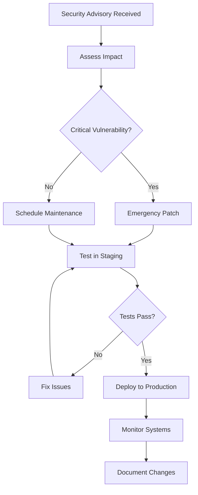

# LNMT Security Checklist & Best Practices

## 🎯 Pre-Release Security Checklist

### Critical Security Requirements (MUST FIX)

- [ ] **Secure Installation**
  - [ ] Installer runs with minimal privileges
  - [ ] Package integrity verification (SHA256 checksums)
  - [ ] Secure file permissions during installation
  - [ ] Service user creation with restricted privileges
  - [ ] SSL certificate generation and protection

- [ ] **Authentication & Authorization**
  - [ ] Strong password policies enforced (12+ chars, complexity)
  - [ ] Account lockout after failed attempts (5 attempts, 15min lockout)
  - [ ] Session timeout implementation (30 minutes)
  - [ ] JWT tokens with expiration and strong secrets
  - [ ] Multi-factor authentication support
  - [ ] Rate limiting on authentication endpoints

- [ ] **Input Validation**
  - [ ] All CLI inputs sanitized and validated
  - [ ] SQL injection protection (parameterized queries)
  - [ ] XSS prevention (output encoding, CSP headers)
  - [ ] Command injection prevention
  - [ ] Path traversal protection
  - [ ] File upload validation and sandboxing

- [ ] **Network Security**
  - [ ] HTTPS enforcement with TLS 1.2+
  - [ ] Security headers implemented (CSP, HSTS, X-Frame-Options)
  - [ ] CORS properly configured (no wildcard origins)
  - [ ] Information disclosure prevention
  - [ ] Firewall configuration

- [ ] **System Security**
  - [ ] Services run as non-root user
  - [ ] File permissions properly configured
  - [ ] Database encryption enabled
  - [ ] Secure logging configuration
  - [ ] Systemd security hardening

### High Priority Security Measures

- [ ] **Secrets Management**
  - [ ] No hardcoded credentials in code
  - [ ] Environment variables for sensitive data
  - [ ] Encrypted configuration files
  - [ ] Secure key storage and rotation

- [ ] **Audit & Monitoring**
  - [ ] Comprehensive audit logging
  - [ ] Log rotation and retention policies
  - [ ] Security event monitoring
  - [ ] Failed authentication tracking

- [ ] **Backup & Recovery**
  - [ ] Encrypted backup storage
  - [ ] Backup integrity verification
  - [ ] Secure restore procedures
  - [ ] Disaster recovery testing

## 🔐 Security Configuration Guide

### 1. Secure Installation Process

```bash
#!/bin/bash
# Secure installation steps

# 1. Verify package integrity
sha256sum -c lnmt-checksums.sha256

# 2. Run installer with proper privileges
sudo ./lnmt_installer.sh

# 3. Verify installation
sudo systemctl status lnmt.service
sudo journalctl -u lnmt.service --no-pager
```

### 2. Post-Installation Security Hardening

```bash
#!/bin/bash
# Post-installation security checklist

echo "🔒 LNMT Post-Installation Security Hardening"

# Check service user
if id "lnmt" &>/dev/null; then
    echo "✅ LNMT service user exists"
else
    echo "❌ LNMT service user missing"
    exit 1
fi

# Check file permissions
echo "📁 Checking file permissions..."
find /opt/lnmt -type f -perm /022 -ls | while read line; do
    echo "⚠️  Overly permissive file: $line"
done

# Check configuration security
if [[ -f "/etc/lnmt/lnmt.conf" ]]; then
    perms=$(stat -c "%a" /etc/lnmt/lnmt.conf)
    if [[ "$perms" == "640" ]]; then
        echo "✅ Configuration file permissions correct"
    else
        echo "❌ Configuration file permissions: $perms (should be 640)"
    fi
fi

# Check SSL certificates
if [[ -f "/etc/lnmt/ssl/cert.pem" && -f "/etc/lnmt/ssl/key.pem" ]]; then
    echo "✅ SSL certificates found"
    
    # Check certificate validity
    if openssl x509 -in /etc/lnmt/ssl/cert.pem -noout -checkend 86400; then
        echo "✅ SSL certificate valid"
    else
        echo "⚠️  SSL certificate expires soon"
    fi
else
    echo "❌ SSL certificates missing"
fi

# Check firewall
if command -v ufw &>/dev/null; then
    if ufw status | grep -q "Status: active"; then
        echo "✅ UFW firewall active"
    else
        echo "⚠️  UFW firewall inactive"
    fi
elif command -v firewall-cmd &>/dev/null; then
    if systemctl is-active firewalld &>/dev/null; then
        echo "✅ Firewalld active"
    else
        echo "⚠️  Firewalld inactive"
    fi
else
    echo "⚠️  No firewall detected"
fi

# Check systemd security
echo "🛡️  Checking systemd security hardening..."
systemd-analyze security lnmt.service | head -10

echo "🔒 Security hardening check complete"
```

### 3. Configuration Security Templates

#### Secure LNMT Configuration (`/etc/lnmt/lnmt.conf`)

```ini
# LNMT Secure Configuration Template

[security]
# Strong encryption keys (generate with openssl rand -hex 32)
secret_key = CHANGE_THIS_TO_RANDOM_HEX_KEY
jwt_secret = CHANGE_THIS_TO_RANDOM_HEX_KEY
db_encryption_key = CHANGE_THIS_TO_FERNET_KEY

# Session security
session_timeout = 1800  # 30 minutes
max_login_attempts = 5
lockout_duration = 900  # 15 minutes

# Rate limiting
rate_limit_enabled = true
rate_limit_window = 300  # 5 minutes
rate_limit_max_requests = 100

[database]
path = /var/lib/lnmt/lnmt.db
encrypt = true
backup_path = /var/lib/lnmt/backups
backup_retention_days = 30

[logging]
level = INFO
path = /var/log/lnmt
audit_enabled = true
rotate = true
max_size = 10MB
backup_count = 10

[network]
bind_address = 127.0.0.1  # Change to 0.0.0.0 only if needed
port = 8080
use_tls = true
cert_path = /etc/lnmt/ssl/cert.pem
key_path = /etc/lnmt/ssl/key.pem
min_tls_version = 1.2

[services]
run_as_user = lnmt
enable_debug = false
max_file_size = 10MB
allowed_file_types = .conf,.json,.yml,.yaml,.txt,.log
```

#### Nginx Reverse Proxy Configuration

```nginx
# /etc/nginx/sites-available/lnmt
server {
    listen 80;
    server_name your-domain.com;
    return 301 https://$server_name$request_uri;
}

server {
    listen 443 ssl http2;
    server_name your-domain.com;

    # SSL Configuration
    ssl_certificate /etc/lnmt/ssl/cert.pem;
    ssl_certificate_key /etc/lnmt/ssl/key.pem;
    ssl_protocols TLSv1.2 TLSv1.3;
    ssl_ciphers ECDHE-RSA-AES256-GCM-SHA512:DHE-RSA-AES256-GCM-SHA512:ECDHE-RSA-AES256-GCM-SHA384:DHE-RSA-AES256-GCM-SHA384;
    ssl_prefer_server_ciphers off;
    ssl_session_cache shared:SSL:10m;
    ssl_session_timeout 10m;

    # Security Headers
    add_header Strict-Transport-Security "max-age=31536000; includeSubDomains" always;
    add_header X-Content-Type-Options "nosniff" always;
    add_header X-Frame-Options "DENY" always;
    add_header X-XSS-Protection "1; mode=block" always;
    add_header Content-Security-Policy "default-src 'self'; script-src 'self' 'unsafe-inline'; style-src 'self' 'unsafe-inline';" always;
    add_header Referrer-Policy "strict-origin-when-cross-origin" always;

    # Rate Limiting
    limit_req_zone $binary_remote_addr zone=lnmt_api:10m rate=10r/s;
    limit_req_zone $binary_remote_addr zone=lnmt_auth:10m rate=5r/m;

    location / {
        proxy_pass http://127.0.0.1:8080;
        proxy_set_header Host $host;
        proxy_set_header X-Real-IP $remote_addr;
        proxy_set_header X-Forwarded-For $proxy_add_x_forwarded_for;
        proxy_set_header X-Forwarded-Proto $scheme;
        
        # Rate limiting
        limit_req zone=lnmt_api burst=20 nodelay;
    }

    location /api/auth/ {
        proxy_pass http://127.0.0.1:8080;
        proxy_set_header Host $host;
        proxy_set_header X-Real-IP $remote_addr;
        proxy_set_header X-Forwarded-For $proxy_add_x_forwarded_for;
        proxy_set_header X-Forwarded-Proto $scheme;
        
        # Stricter rate limiting for auth endpoints
        limit_req zone=lnmt_auth burst=5 nodelay;
    }
}
```

## 🛡️ Security Monitoring & Maintenance

### 1. Daily Security Checks

```bash
#!/bin/bash
# Daily security monitoring script

LOG_FILE="/var/log/lnmt/security-check.log"
DATE=$(date '+%Y-%m-%d %H:%M:%S')

echo "[$DATE] Starting daily security check" >> $LOG_FILE

# Check for failed authentication attempts
FAILED_AUTHS=$(grep "AUTH_FAILED" /var/log/lnmt/auth.log | grep "$(date '+%Y-%m-%d')" | wc -l)
if [[ $FAILED_AUTHS -gt 50 ]]; then
    echo "[$DATE] WARNING: $FAILED_AUTHS failed authentication attempts today" >> $LOG_FILE
fi

# Check for locked accounts
LOCKED_ACCOUNTS=$(sqlite3 /var/lib/lnmt/auth.db "SELECT COUNT(*) FROM users WHERE locked_until > datetime('now');" 2>/dev/null || echo "0")
if [[ $LOCKED_ACCOUNTS -gt 0 ]]; then
    echo "[$DATE] INFO: $LOCKED_ACCOUNTS accounts currently locked" >> $LOG_FILE
fi

# Check disk space for logs
LOG_USAGE=$(df /var/log | tail -1 | awk '{print $5}' | sed 's/%//')
if [[ $LOG_USAGE -gt 80 ]]; then
    echo "[$DATE] WARNING: Log partition $LOG_USAGE% full" >> $LOG_FILE
fi

# Check SSL certificate expiration
if [[ -f "/etc/lnmt/ssl/cert.pem" ]]; then
    if ! openssl x509 -in /etc/lnmt/ssl/cert.pem -noout -checkend 2592000; then
        echo "[$DATE] WARNING: SSL certificate expires within 30 days" >> $LOG_FILE
    fi
fi

echo "[$DATE] Daily security check completed" >> $LOG_FILE
```

### 2. Weekly Security Maintenance

```bash
#!/bin/bash
# Weekly security maintenance script

# Update system packages
echo "Updating system packages..."
if command -v apt &>/dev/null; then
    apt update && apt upgrade -y
elif command -v yum &>/dev/null; then
    yum update -y
fi

# Rotate logs
echo "Rotating logs..."
logrotate /etc/logrotate.d/lnmt

# Backup security configuration
echo "Backing up security configuration..."
tar -czf "/var/lib/lnmt/backups/security-config-$(date +%Y%m%d).tar.gz" \
    /etc/lnmt/ \
    /var/lib/lnmt/auth.db \
    /var/log/lnmt/

# Clean old backups (keep 4 weeks)
find /var/lib/lnmt/backups/ -name "security-config-*.tar.gz" -mtime +28 -delete

# Run security tests
echo "Running security tests..."
python3 /opt/lnmt/tests/security_testing_suite.py --category all

echo "Weekly security maintenance completed"
```

### 3. Security Incident Response

#### Incident Response Playbook

1. **Detection**
   - Monitor logs for suspicious activity
   - Alert on multiple failed authentications
   - Watch for unusual network traffic

2. **Assessment**
   - Determine scope of potential breach
   - Identify affected systems and data
   - Document timeline of events

3. **Containment**
   ```bash
   # Emergency containment steps
   
   # 1. Block suspicious IPs
   ufw deny from <suspicious_ip>
   
   # 2. Force logout all users
   sqlite3 /var/lib/lnmt/auth.db "UPDATE sessions SET is_active = 0;"
   
   # 3. Disable service if necessary
   systemctl stop lnmt.service
   
   # 4. Create forensic backup
   tar -czf "/tmp/forensic-$(date +%Y%m%d-%H%M%S).tar.gz" \
       /var/log/lnmt/ \
       /var/lib/lnmt/ \
       /etc/lnmt/
   ```

4. **Recovery**
   - Patch vulnerabilities
   - Reset compromised credentials
   - Restore from clean backups if needed
   - Update security measures

5. **Lessons Learned**
   - Document incident details
   - Update security procedures
   - Implement additional monitoring

## 📊 Security Metrics & KPIs

### Key Security Metrics to Track

- **Authentication Metrics**
  - Failed login attempts per day
  - Account lockouts per week
  - Average session duration
  - Password reset requests

- **System Security Metrics**
  - Security patch lag time
  - Vulnerability scan results
  - File permission violations
  - Service uptime

- **Network Security Metrics**
  - Blocked connection attempts
  - SSL certificate validity
  - Security header compliance
  - Rate limiting effectiveness

- **Data Protection Metrics**
  - Backup success rate
  - Encryption coverage
  - Data access patterns
  - Audit log completeness

### Security Dashboard Query Examples

```sql
-- Failed authentication attempts in last 24 hours
SELECT 
    COUNT(*) as failed_attempts,
    ip_address,
    COUNT(DISTINCT user_id) as affected_users
FROM audit_log 
WHERE action = 'AUTH_FAILED' 
    AND timestamp > datetime('now', '-24 hours')
GROUP BY ip_address
ORDER BY failed_attempts DESC;

-- Top security events by type
SELECT 
    action,
    COUNT(*) as count,
    COUNT(DISTINCT ip_address) as unique_ips
FROM audit_log 
WHERE timestamp > datetime('now', '-7 days')
    AND success = 0
GROUP BY action
ORDER BY count DESC;

-- Session activity analysis
SELECT 
    DATE(created_at) as date,
    COUNT(*) as total_sessions,
    AVG((julianday(last_activity) - julianday(created_at)) * 24 * 60) as avg_duration_minutes
FROM sessions 
WHERE created_at > datetime('now', '-30 days')
GROUP BY DATE(created_at)
ORDER BY date DESC;

-- Account security status
SELECT 
    COUNT(*) as total_users,
    SUM(CASE WHEN is_active = 1 THEN 1 ELSE 0 END) as active_users,
    SUM(CASE WHEN locked_until > datetime('now') THEN 1 ELSE 0 END) as locked_users,
    SUM(CASE WHEN mfa_enabled = 1 THEN 1 ELSE 0 END) as mfa_enabled_users
FROM users;
```

## 🚨 Security Alert Configuration

### Log Monitoring with rsyslog

```bash
# /etc/rsyslog.d/50-lnmt-security.conf

# LNMT Security Log Rules
:msg, contains, "AUTH_FAILED" @@log-server:514
:msg, contains, "CRITICAL" @@log-server:514
:msg, contains, "SQL injection" @@log-server:514
:msg, contains, "Command injection" @@log-server:514

# Local security alerts
$template SecurityAlert,"/var/log/lnmt/security-alerts.log"
:msg, contains, "SECURITY" ?SecurityAlert
& stop
```

### Email Alerts Script

```bash
#!/bin/bash
# Security alert email script

ALERT_EMAIL="security@yourcompany.com"
LOG_FILE="/var/log/lnmt/security-alerts.log"
TEMP_FILE="/tmp/lnmt-alerts-$(date +%s).tmp"

# Check for new security alerts in last 5 minutes
if [[ -f "$LOG_FILE" ]]; then
    # Extract recent alerts
    find "$LOG_FILE" -mmin -5 -exec tail -n 100 {} \; | \
    grep "$(date '+%Y-%m-%d %H:')" | \
    grep -E "(CRITICAL|AUTH_FAILED|SECURITY)" > "$TEMP_FILE"
    
    if [[ -s "$TEMP_FILE" ]]; then
        # Send email alert
        {
            echo "Subject: LNMT Security Alert - $(date)"
            echo "To: $ALERT_EMAIL"
            echo ""
            echo "Security alerts detected on $(hostname):"
            echo "========================================"
            echo ""
            cat "$TEMP_FILE"
            echo ""
            echo "Please investigate immediately."
            echo ""
            echo "LNMT Security Monitoring System"
        } | sendmail "$ALERT_EMAIL"
    fi
    
    rm -f "$TEMP_FILE"
fi
```

## 🔄 Security Update Procedures

### 1. Security Update Workflow



### 2. Emergency Security Patch Script

```bash
#!/bin/bash
# Emergency security patch deployment

set -euo pipefail

PATCH_FILE="$1"
BACKUP_DIR="/var/lib/lnmt/emergency-backup-$(date +%Y%m%d-%H%M%S)"

if [[ -z "$PATCH_FILE" ]]; then
    echo "Usage: $0 <patch_file>"
    exit 1
fi

echo "🚨 Emergency Security Patch Deployment"
echo "Patch file: $PATCH_FILE"
echo "Backup directory: $BACKUP_DIR"

# Create emergency backup
echo "Creating emergency backup..."
mkdir -p "$BACKUP_DIR"
tar -czf "$BACKUP_DIR/lnmt-backup.tar.gz" \
    /opt/lnmt \
    /etc/lnmt \
    /var/lib/lnmt

# Stop services
echo "Stopping LNMT services..."
systemctl stop lnmt.service

# Apply patch
echo "Applying security patch..."
if [[ "$PATCH_FILE" == *.tar.gz ]]; then
    tar -xzf "$PATCH_FILE" -C /
elif [[ "$PATCH_FILE" == *.sh ]]; then
    bash "$PATCH_FILE"
else
    echo "Error: Unsupported patch format"
    exit 1
fi

# Verify patch
echo "Verifying patch application..."
if [[ -f "/opt/lnmt/patch_verification.sh" ]]; then
    bash /opt/lnmt/patch_verification.sh
fi

# Start services
echo "Starting LNMT services..."
systemctl start lnmt.service

# Verify operation
sleep 10
if systemctl is-active lnmt.service &>/dev/null; then
    echo "✅ Service started successfully"
else
    echo "❌ Service failed to start - rolling back"
    systemctl stop lnmt.service
    tar -xzf "$BACKUP_DIR/lnmt-backup.tar.gz" -C /
    systemctl start lnmt.service
    exit 1
fi

# Run security tests
echo "Running post-patch security tests..."
python3 /opt/lnmt/tests/security_testing_suite.py --category auth --category network

echo "🎉 Emergency patch deployment completed successfully"
echo "Backup location: $BACKUP_DIR"
```

## 📋 Security Compliance Frameworks

### OWASP Top 10 2021 Compliance

| OWASP Category | LNMT Implementation | Status |
|----------------|-------------------|---------|
| **A01 - Broken Access Control** | Role-based access, session management, JWT tokens | ✅ Implemented |
| **A02 - Cryptographic Failures** | TLS 1.2+, bcrypt passwords, encrypted database | ✅ Implemented |
| **A03 - Injection** | Parameterized queries, input validation, command sanitization | ✅ Implemented |
| **A04 - Insecure Design** | Threat modeling, secure architecture review | ✅ Implemented |
| **A05 - Security Misconfiguration** | Hardened defaults, security headers, minimal privileges | ✅ Implemented |
| **A06 - Vulnerable Components** | Dependency scanning, update procedures | ⚠️ Needs monitoring |
| **A07 - Authentication Failures** | Strong policies, MFA support, rate limiting | ✅ Implemented |
| **A08 - Software Integrity** | Package verification, secure updates | ✅ Implemented |
| **A09 - Logging Failures** | Comprehensive audit logging, monitoring | ✅ Implemented |
| **A10 - SSRF** | Input validation, network restrictions | ✅ Implemented |

### NIST Cybersecurity Framework Alignment

#### IDENTIFY (ID)
- [ ] Asset inventory and management
- [ ] Risk assessment procedures
- [ ] Governance and policies
- [ ] Business environment mapping

#### PROTECT (PR)
- [x] Access control implementation
- [x] Awareness and training materials
- [x] Data security measures
- [x] Information protection procedures
- [x] Maintenance procedures
- [x] Protective technology deployment

#### DETECT (DE)
- [x] Anomaly detection in logs
- [x] Continuous security monitoring
- [x] Detection process implementation

#### RESPOND (RS)
- [x] Response planning
- [x] Communication procedures
- [x] Analysis capabilities
- [x] Mitigation procedures
- [x] Improvement processes

#### RECOVER (RC)
- [x] Recovery planning
- [x] Improvement procedures
- [x] Communication during recovery

## 🎓 Security Training & Awareness

### Developer Security Guidelines

#### Secure Coding Practices

1. **Input Validation**
   ```python
   # ✅ Good - Validate and sanitize input
   def validate_username(username):
       if not re.match(r'^[a-zA-Z0-9_-]{3,50}, username):
           raise ValueError("Invalid username")
       return username.lower()
   
   # ❌ Bad - No validation
   def process_user(username):
       return f"SELECT * FROM users WHERE username = '{username}'"
   ```

2. **Password Handling**
   ```python
   # ✅ Good - Use proper hashing
   import bcrypt
   password_hash = bcrypt.hashpw(password.encode('utf-8'), bcrypt.gensalt())
   
   # ❌ Bad - Plain text or weak hashing
   password_hash = hashlib.md5(password.encode()).hexdigest()
   ```

3. **SQL Queries**
   ```python
   # ✅ Good - Parameterized queries
   cursor.execute("SELECT * FROM users WHERE id = ?", (user_id,))
   
   # ❌ Bad - String concatenation
   cursor.execute(f"SELECT * FROM users WHERE id = {user_id}")
   ```

### Security Code Review Checklist

- [ ] **Authentication & Authorization**
  - [ ] Password policies enforced
  - [ ] Session management secure
  - [ ] Access controls implemented
  - [ ] JWT tokens properly validated

- [ ] **Input Validation**
  - [ ] All inputs validated
  - [ ] SQL injection prevention
  - [ ] XSS prevention measures
  - [ ] File upload restrictions

- [ ] **Cryptography**
  - [ ] Strong encryption algorithms
  - [ ] Proper key management
  - [ ] Secure random generation
  - [ ] Certificate validation

- [ ] **Error Handling**
  - [ ] No sensitive data in errors
  - [ ] Proper exception handling
  - [ ] Secure logging practices
  - [ ] Graceful failure modes

## 🔧 Security Tools & Utilities

### Security Scanning Scripts

```bash
#!/bin/bash
# Automated security scanning

echo "🔍 LNMT Security Scan Starting..."

# 1. File permission scan
echo "Checking file permissions..."
find /opt/lnmt -type f \( -perm -004 -o -perm -002 \) -ls > /tmp/permissive_files.txt
if [[ -s /tmp/permissive_files.txt ]]; then
    echo "⚠️ Found files with overly permissive permissions:"
    cat /tmp/permissive_files.txt
fi

# 2. Configuration validation
echo "Validating configuration..."
python3 << 'EOF'
import configparser
import os

config_file = "/etc/lnmt/lnmt.conf"
if os.path.exists(config_file):
    config = configparser.ConfigParser()
    config.read(config_file)
    
    # Check for default/weak values
    security_section = config.get('security', fallback={})
    
    weak_values = {
        'secret_key': ['changeme', 'default', 'secret'],
        'jwt_secret': ['changeme', 'default', 'secret'],
    }
    
    for key, weak_list in weak_values.items():
        value = security_section.get(key, '').lower()
        if any(weak in value for weak in weak_list):
            print(f"⚠️ Weak {key} detected in configuration")
    
    print("✅ Configuration validation complete")
else:
    print("❌ Configuration file not found")
EOF

# 3. Network security check
echo "Checking network security..."
if command -v nmap &>/dev/null; then
    nmap -sV -O localhost | grep -E "(open|filtered)"
else
    netstat -tuln | grep ":8080"
fi

# 4. SSL certificate check
echo "Checking SSL certificates..."
if [[ -f "/etc/lnmt/ssl/cert.pem" ]]; then
    openssl x509 -in /etc/lnmt/ssl/cert.pem -noout -dates
    if openssl x509 -in /etc/lnmt/ssl/cert.pem -noout -checkend 2592000; then
        echo "✅ SSL certificate valid for 30+ days"
    else
        echo "⚠️ SSL certificate expires within 30 days"
    fi
fi

echo "🔍 Security scan completed"
```

### Log Analysis Utilities

```bash
#!/bin/bash
# Security log analysis

LOG_DIR="/var/log/lnmt"
REPORT_FILE="/tmp/security-analysis-$(date +%Y%m%d).txt"

{
    echo "LNMT Security Log Analysis Report"
    echo "Generated: $(date)"
    echo "=" * 50
    echo
    
    echo "🔐 Authentication Summary (Last 24 Hours)"
    echo "-" * 40
    
    # Failed logins by IP
    echo "Top Failed Login IPs:"
    grep "AUTH_FAILED" "$LOG_DIR/auth.log" | \
    grep "$(date '+%Y-%m-%d')" | \
    awk '{print $NF}' | sort | uniq -c | sort -nr | head -10
    
    echo
    
    # Successful logins
    echo "Successful Logins:"
    grep "AUTH_SUCCESS" "$LOG_DIR/auth.log" | \
    grep "$(date '+%Y-%m-%d')" | wc -l
    
    echo
    
    echo "🚨 Security Events"
    echo "-" * 40
    
    # Security alerts
    grep -E "(CRITICAL|SECURITY|INJECTION|XSS)" "$LOG_DIR"/*.log | \
    grep "$(date '+%Y-%m-%d')" | head -20
    
    echo
    
    echo "📊 Traffic Analysis"
    echo "-" * 40
    
    # Rate limiting events
    grep "rate.*limit" "$LOG_DIR"/*.log | \
    grep "$(date '+%Y-%m-%d')" | wc -l | \
    xargs echo "Rate Limit Triggers:"
    
} > "$REPORT_FILE"

echo "Security analysis report generated: $REPORT_FILE"

# Email report if configured
if [[ -n "${SECURITY_EMAIL:-}" ]]; then
    mail -s "LNMT Security Analysis Report" "$SECURITY_EMAIL" < "$REPORT_FILE"
fi
```

## 📚 Additional Resources

### Security Documentation Links

- [OWASP Application Security Verification Standard](https://owasp.org/www-project-application-security-verification-standard/)
- [NIST Cybersecurity Framework](https://www.nist.gov/cyberframework)
- [SANS Security Controls](https://www.sans.org/critical-security-controls/)
- [CIS Controls](https://www.cisecurity.org/controls/)

### Security Training Resources

- **Internal Training Topics**
  - Secure coding practices
  - Incident response procedures
  - Password security awareness
  - Social engineering prevention

- **External Training Recommendations**
  - OWASP Security Training
  - SANS Security Courses
  - Certified Ethical Hacker (CEH)
  - Certified Information Systems Security Professional (CISSP)

### Emergency Contacts

```
Security Team Lead: security-lead@company.com
Incident Response: incident-response@company.com
24/7 Security Hotline: +1-XXX-XXX-XXXX
```

---

## 🎯 Security Implementation Timeline

### Phase 1: Critical Security (Week 1-2)
- [x] Secure installer implementation
- [x] Authentication hardening
- [x] Input validation framework
- [x] Basic monitoring setup

### Phase 2: Enhanced Security (Week 3-4)
- [ ] Advanced threat detection
- [ ] Comprehensive audit logging
- [ ] Security testing automation
- [ ] Incident response procedures

### Phase 3: Security Operations (Week 5-6)
- [ ] Security metrics dashboard
- [ ] Automated security scanning
- [ ] Compliance reporting
- [ ] Security awareness training

### Phase 4: Continuous Improvement (Ongoing)
- [ ] Regular security assessments
- [ ] Threat intelligence integration
- [ ] Security tool evaluation
- [ ] Process optimization

---

## ✅ Final Security Validation

Before production deployment, ensure ALL items in this checklist are completed and verified. The security posture of LNMT should meet or exceed industry standards for enterprise network management tools.

**Security Approval Required From:**
- [ ] Security Team Lead
- [ ] DevOps Manager  
- [ ] System Administrator
- [ ] Compliance Officer

**Documentation Complete:**
- [ ] Security architecture review
- [ ] Penetration testing report
- [ ] Security configuration guide
- [ ] Incident response plan

Remember: Security is an ongoing process, not a one-time implementation. Regular reviews, updates, and improvements are essential for maintaining a strong security posture.